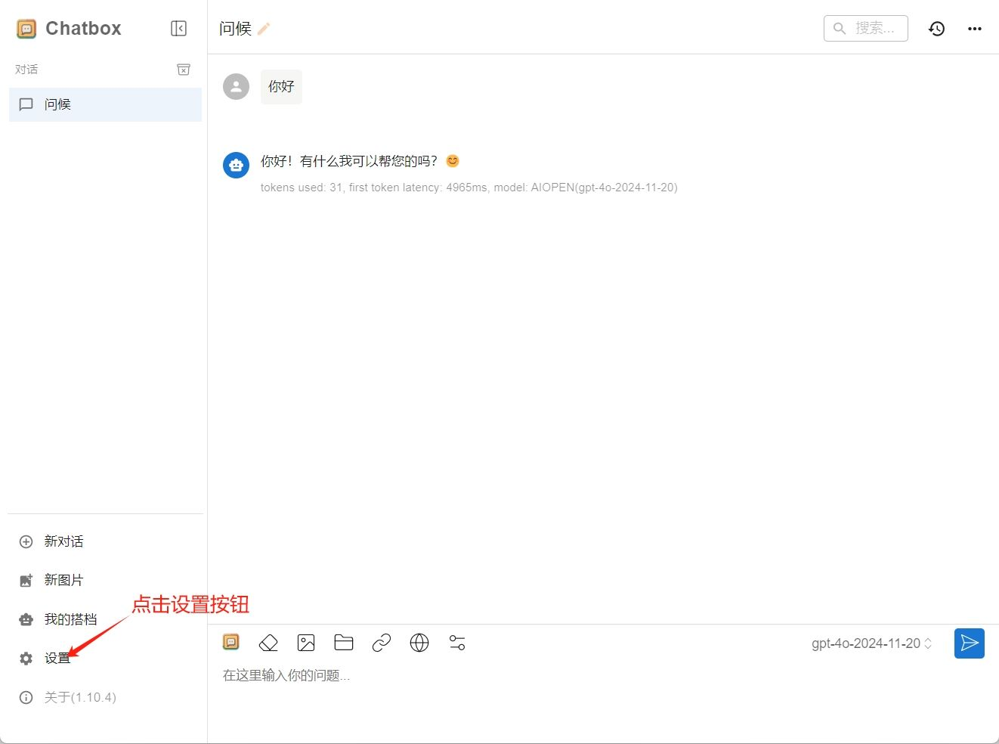
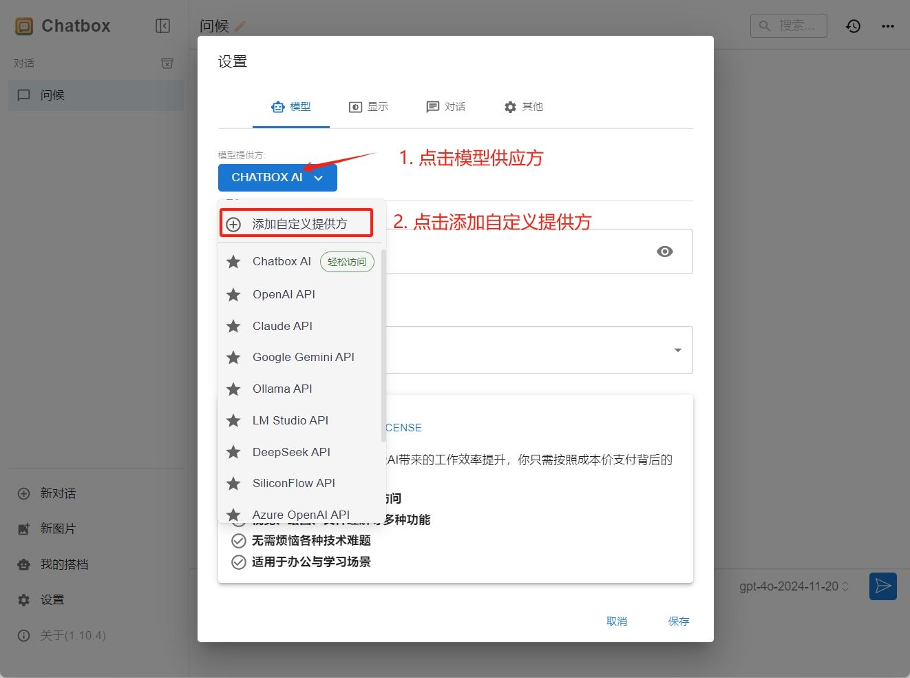
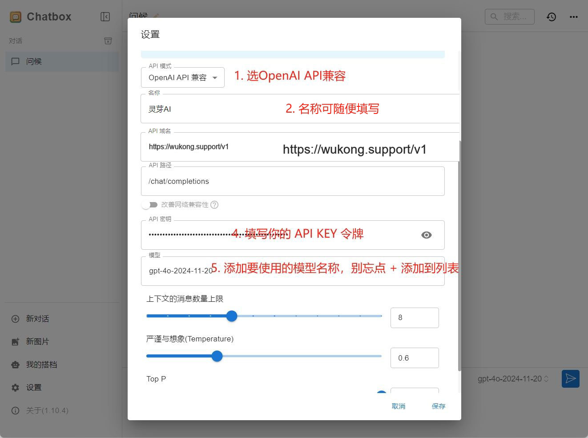

# 在Chatbox中使用 悟空 API

> Chatbox AI 是一款 AI 客户端应用和智能助手，支持众多先进的 AI 模型和 API，可在 Windows、MacOS、Android、iOS、Linux 和网页版上使用。

### Step 1
访问 `Chatbox` 应用[https://chatboxai.app](https://chatboxai.app/) 下载相应APP

### Step 2

点击左下角设置，打开配置页面，如下图示例配置

配置填写：
1. 接口地址：`https://api.wukong.support/v1`
2. Api 密钥：在 [我的令牌](https://wukong.support/console/token) 处创建复制你的专属 Api Key

#### 自定义模型说明：
格式：直接填写模型列表处模型名称 如：gpt-4o、deepseek-r1-all等，具体模型名查看 [模型列表](https://wukong.support/modellist)

