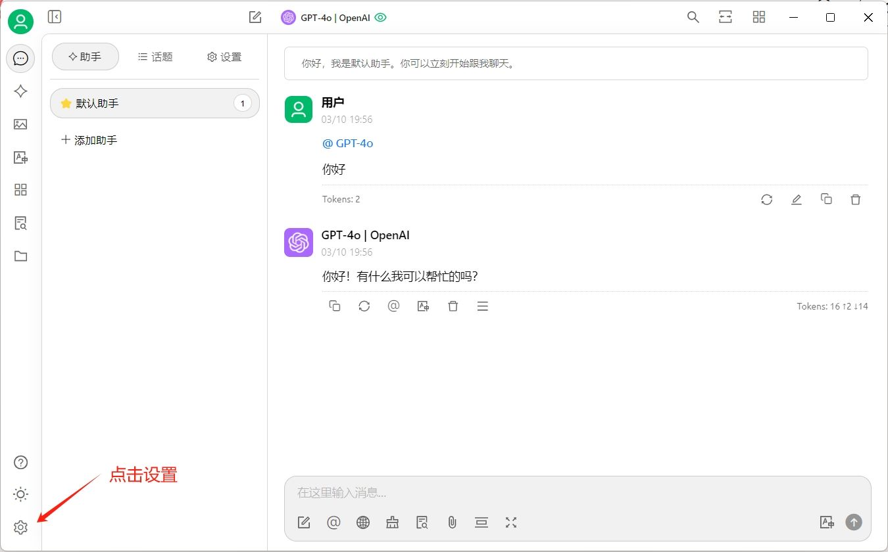
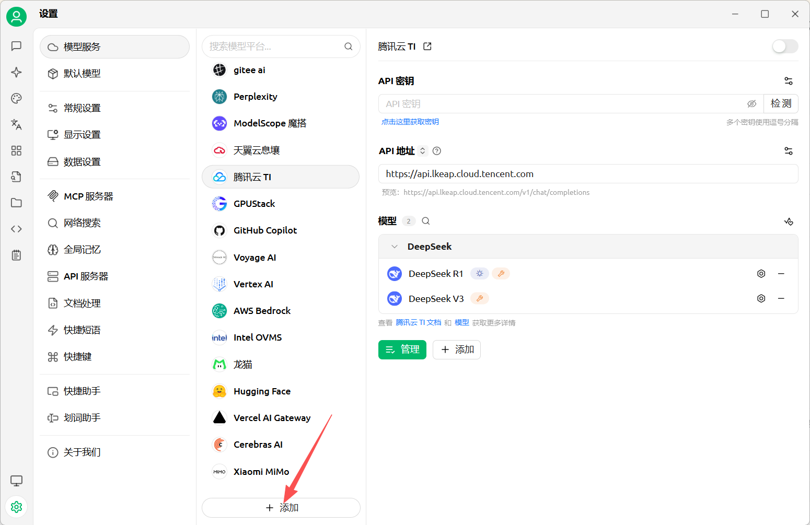
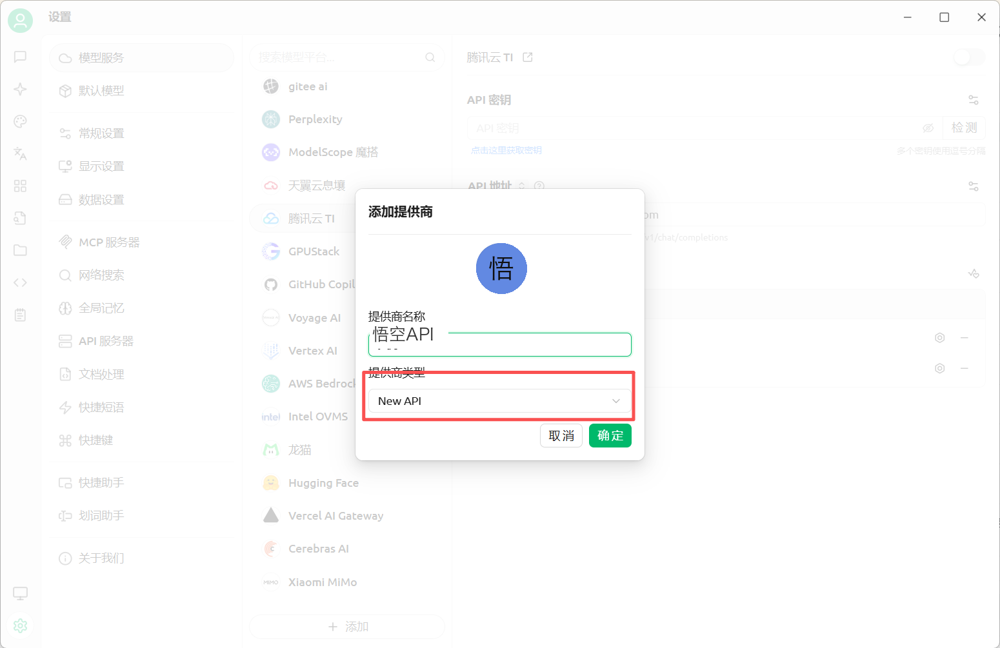
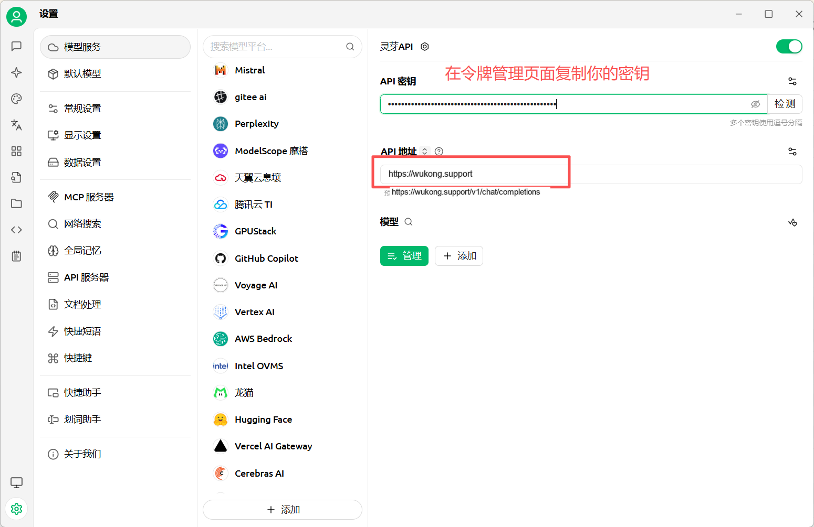
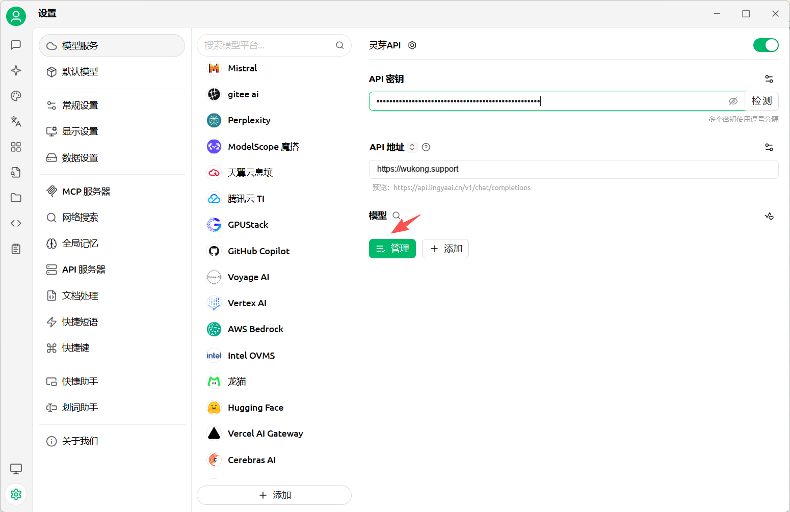
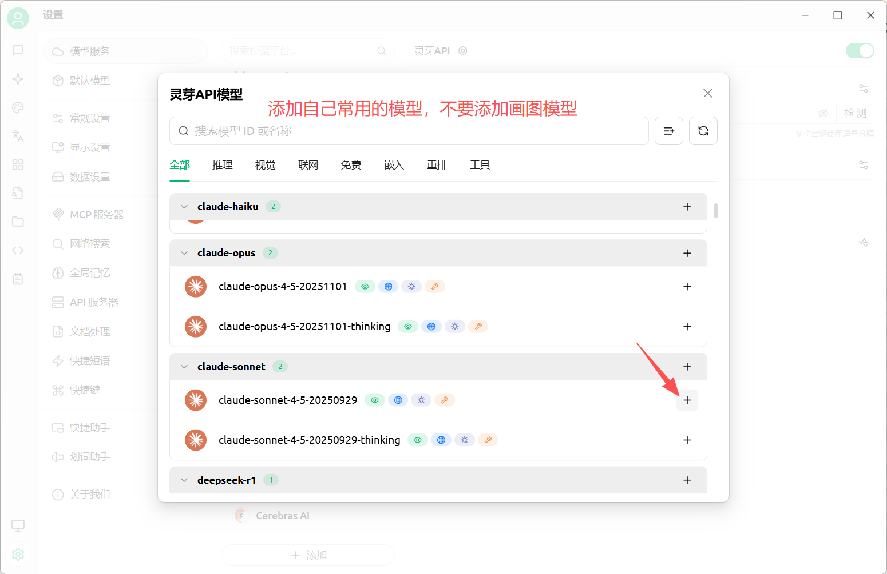
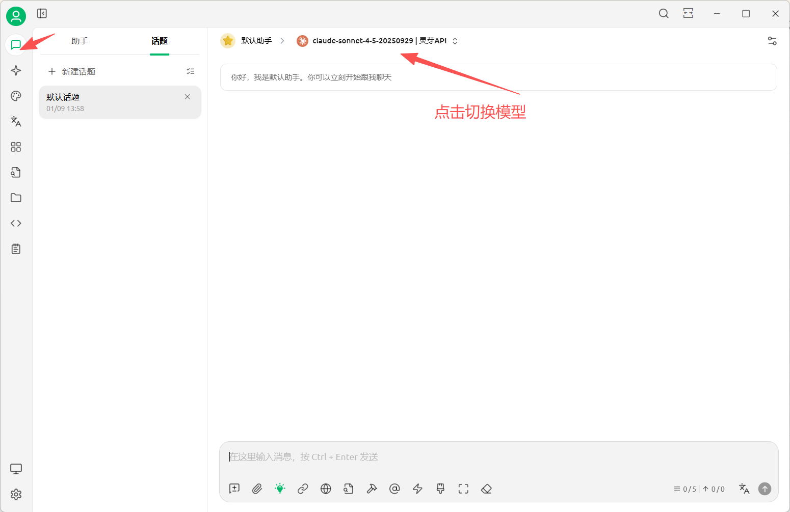

# 在Cherry Studio中使用 熊猫 API

> Cherry Studio AI 是一款强大的多模型 AI 助手，支持 iOS、macOS 和 Windows 平台。快速切换多个先进的 LLM 模型，提升工作学习效率。

### Step 1
访问 `Cherry Studio` 应用[https://cherry-ai.com](https://cherry-ai.com) 下载客户端。（如果下载速度慢，到下载页面下拉，切换线路试试。）

### Step 2

点击左下角设置，打开配置页面，如下图示例配置

只需填写两项：
1. 接口地址：`https://api.wukong.support`
2. Api Key：在 [我的令牌](https://wukong.support/console/token) 处创建复制你的专属 Api Key

### 知识库

1. 添加嵌入模型 ```qwen3-embedding-8b```、```bge-m3```、 ```text-embedding-3-small```、 ```text-embedding-3-large``` 任选一个。
2. 添加重排序模型 ```qwen3-reranker-8b```、```bge-reranker-v2-m3```













