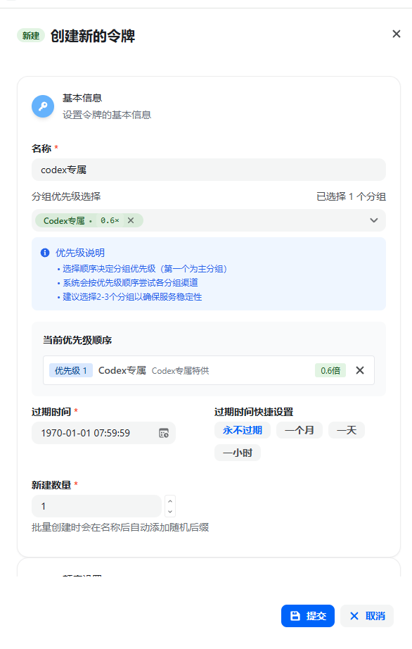
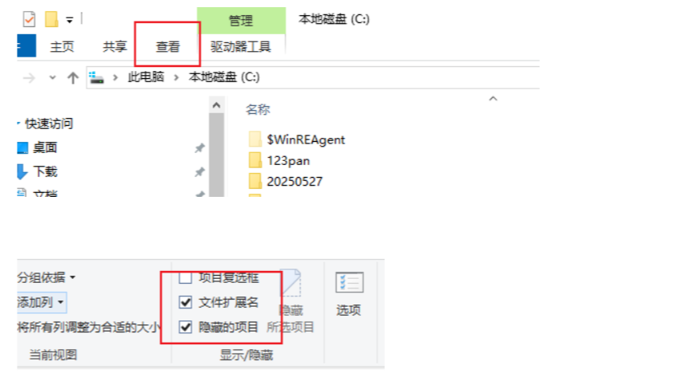
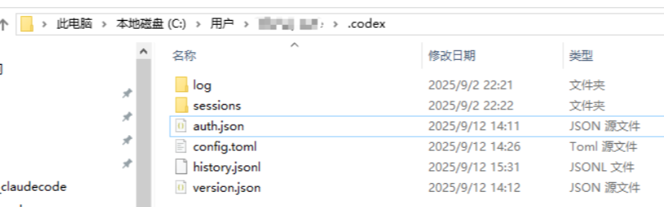
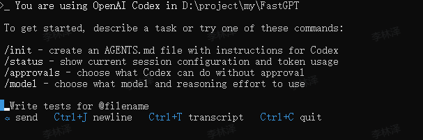
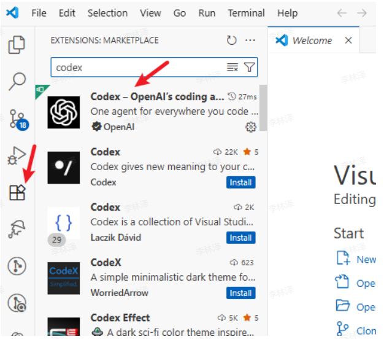
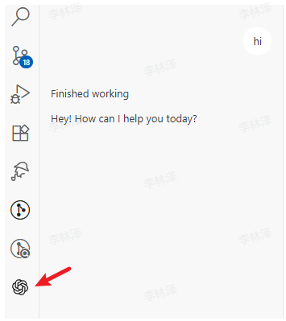
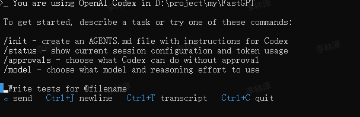
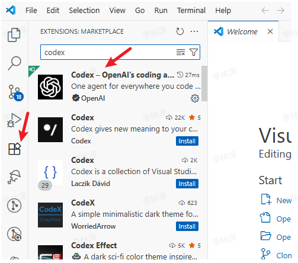
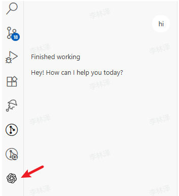

# Codex 配置教程

---

## Windows 版本教程

### 系统要求
- Windows 10 或 Windows 11
- Node.js 22+
- npm 10+
- 网络连接

### 安装步骤

**前置步骤！！！**
安装 Git Bash，请访问 [Git - Downloads](https://git-scm.com/downloads) 下载对应您电脑系统的版本，之后一直点击“下一步”即可完成安装。

**1. 安装 Node.js**
访问 [Node.js 官网](https://nodejs.org/) 下载并安装最新 LTS 版本。

**2. 安装 Codex**
打开命令提示符 `CMD` 或 `PowerShell`，运行：

```bash
npm install -g @openai/codex
```

**3. 验证安装**
打开命令提示符 `CMD` 或 `PowerShell`，运行：

```bash
codex --version
```

### 配置 API

**1. 获取 Auth Token**
访问 [wukong.support](https://wukong.support) 站点页面进行以下操作：

- 点击 **控制台 → API令牌** 页面
- 令牌名称随意（包月的用户，令牌名称为包月的套餐名称，不用单独创建令牌）
- 其他选项保持默认



**2. 配置文件**

> **重要提示**：请将下方的 `sk-xxx` 替换为您在 `wukong.support` 生成的实际 API 密钥。

1. 进入当前用户目录下的 `.codex` 文件夹，例如：`C:\Users\testuser\.codex`。
   如果看不到该目录，请先在文件资源管理器中开启“显示隐藏的项目”。



2. 如果没有 `.codex` 文件夹，请手动创建该文件夹，然后在其中创建 `config.toml` 和 `auth.json` 两个文件。



3. 填写配置。

   `auth.json`：

   ```json
   {"OPENAI_API_KEY": "sk-xxx"}
   ```

   `config.toml`：

   ```toml
   model_provider = "wukong"
   model = "gpt-5.5"
   model_reasoning_effort = "high"
   disable_response_storage = true
   preferred_auth_method = "apikey"

   [model_providers.wukong]
   name = "wukong"
   base_url = "https://codex-origin.wukong.support/v1"
   wire_api = "responses"
   ```

### 启动 Codex

**重启终端！重启终端！重启终端！**
然后进入到您的工程目录：

```bash
cd your-project-folder
```

运行以下命令启动：

```bash
codex
```



### VSCode 插件 Codex

以上配置完成后，在 VSCode 扩展商店中搜索并安装 `codex` 即可。



安装完成后会出现在侧边栏。



-----

## Mac 版本教程

### 系统要求

- macOS 12 或更高版本
- Node.js 22+
- npm 10+
- 网络连接

### 安装步骤

**1. 安装 Node.js**

- 方式一：直接访问 [Node.js 官网](https://nodejs.org/) 下载并安装最新 LTS 版本。
- 方式二：使用 Homebrew（推荐）

  ```bash
  # 如果尚未安装 Homebrew，请先运行此命令
  /bin/bash -c "$(curl -fsSL https://raw.githubusercontent.com/Homebrew/install/HEAD/install.sh)"

  # 安装 Node.js
  brew install node
  ```

**2. 安装 Codex**
打开终端 `Terminal`，运行：

```bash
npm install -g @openai/codex
```

**3. 验证安装**
打开终端 `Terminal`，运行：

```bash
codex --version
```

### 配置 API

**1. 获取 Auth Token**
访问 [wukong.support](https://wukong.support) 站点页面进行以下操作：

- 点击 **控制台 → API令牌** 页面
- 令牌名称随意（包月的用户，令牌名称为包月的套餐名称，不用单独创建令牌）
- 其他选项保持默认


**2. 配置文件**

> **重要提示**：请将下方的 `sk-xxx` 替换为您在 `wukong.support` 生成的实际 API 密钥。

1. 创建目录和文件：

   ```bash
   mkdir -p ~/.codex
   touch ~/.codex/auth.json
   touch ~/.codex/config.toml
   ```

2. 编辑 `auth.json` 文件：

   ```bash
   vi ~/.codex/auth.json
   ```

   按 `i` 进入插入模式，粘贴以下内容，然后按 `ESC`，输入 `:wq` 并回车保存退出。

   ```json
   {"OPENAI_API_KEY": "sk-xxx"}
   ```

3. 编辑 `config.toml` 文件：

   ```bash
   vi ~/.codex/config.toml
   ```

   按 `i` 进入插入模式，粘贴以下内容，然后按 `ESC`，输入 `:wq` 并回车保存退出。

   ```toml
   model_provider = "wukong"
   model = "gpt-5.5"
   model_reasoning_effort = "high"
   disable_response_storage = true
   preferred_auth_method = "apikey"

   [model_providers.wukong]
   name = "wukong"
   base_url = "https://codex-origin.wukong.support/v1"
   wire_api = "responses"
   ```

### 启动 Codex

**重启终端！重启终端！重启终端！**
然后进入到您的工程目录：

```bash
cd your-project-folder
```

运行以下命令启动：

```bash
codex
```

### VSCode 插件 Codex

以上配置完成后，在 VSCode 扩展商店中搜索并安装 `codex` 即可。

-----

## Linux 版本教程

### 系统要求

- 主流 Linux 发行版，例如 Ubuntu 20.04+、Debian 10+、CentOS 7+
- Node.js 22+
- npm 10+
- 网络连接

### 安装步骤

**1. 安装 Node.js**

- Ubuntu / Debian

  ```bash
  sudo apt update
  curl -fsSL https://deb.nodesource.com/setup_lts.x | sudo -E bash -
  sudo apt-get install -y nodejs
  ```

- CentOS / RHEL / Fedora

  ```bash
  # 使用 dnf (Fedora) 或 yum (CentOS / RHEL)
  sudo dnf install nodejs npm
  # 或
  sudo yum install nodejs npm
  ```

- Arch Linux

  ```bash
  sudo pacman -S nodejs npm
  ```

**2. 安装 Codex**
打开终端 `Terminal`，运行：

```bash
sudo npm install -g @openai/codex
```

**3. 验证安装**
打开终端 `Terminal`，运行：

```bash
codex --version
```

### 配置 API

**1. 获取 Auth Token**
访问 [wukong.support](https://wukong.support) 站点页面进行以下操作：

- 点击 **控制台 → API令牌** 页面
- 令牌名称随意（包月的用户，令牌名称为包月的套餐名称，不用单独创建令牌）
- 其他选项保持默认

**2. 配置文件**

> **重要提示**：请将下方的 `sk-xxx` 替换为您在 `wukong.support` 生成的实际 API 密钥。

1. 创建目录和文件：

   ```bash
   mkdir -p ~/.codex
   touch ~/.codex/auth.json
   touch ~/.codex/config.toml
   ```

2. 编辑 `auth.json` 文件：

   ```bash
   vi ~/.codex/auth.json
   ```

   按 `i` 进入插入模式，粘贴以下内容，然后按 `ESC`，输入 `:wq` 并回车保存退出。

   ```json
   {"OPENAI_API_KEY": "sk-xxx"}
   ```

3. 编辑 `config.toml` 文件：

   ```bash
   vi ~/.codex/config.toml
   ```

   按 `i` 进入插入模式，粘贴以下内容，然后按 `ESC`，输入 `:wq` 并回车保存退出。

   ```toml
   model_provider = "wukong"
   model = "gpt-5.5"
   model_reasoning_effort = "high"
   disable_response_storage = true
   preferred_auth_method = "apikey"

   [model_providers.wukong]
   name = "wukong"
   base_url = "https://codex-origin.wukong.support/v1"
   wire_api = "responses"
   ```

### 启动 Codex

**重启终端！重启终端！重启终端！**
然后进入到您的工程目录：

```bash
cd your-project-folder
```

运行以下命令启动：

```bash
codex
```



### VSCode 插件 Codex

以上配置完成后，在 VSCode 扩展商店中搜索并安装 `codex` 即可。



安装完成后会出现在侧边栏。



-----

## 常见问题

**出现错误请按照如下步骤排查：**

1. 确认 API Key 创建是否正确：额度选择 **无限额度**，不要限制模型，并选择正确的 Codex 专属分组。
2. 确认 `auth.json` 与 `config.toml` 放在正确的 `.codex` 目录下。
3. 修改配置后请重启终端，再重新执行 `codex`。

更多 Codex 配置及使用详情请参考 Codex 官方教程。
