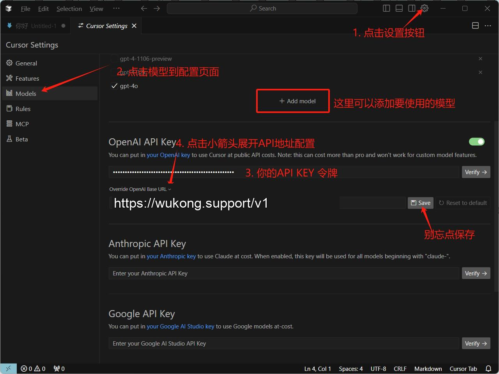

# 在Cursor中使用 悟空 API

> Cursor 是使用 AI 编写代码的最佳方式，一键即可应用模型生成的代码。仅需一个提示，就能更新整段类或函数。

### Step 1
访问 `Cursor` 应用[https://www.cursor.com](https://www.cursor.com/)下载客户端

### Step 2

点击右上角设置，打开配置页面，如下图示例配置

只需填写两项：
1. 接口地址（OpenAI Base URL）：`https://api.wukong.support/v1`
2. Api Key：在 [我的令牌](https://wukong.support/console/token) 处创建复制你的专属 Api Key

#### 自定义模型说明：
格式：直接填写模型列表处模型名称 如：gpt-4o、deepseek-r1-all等，具体模型名查看 [模型列表](https://wukong.support/modellist)

