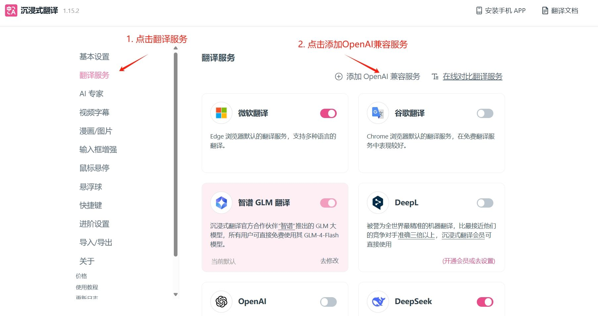
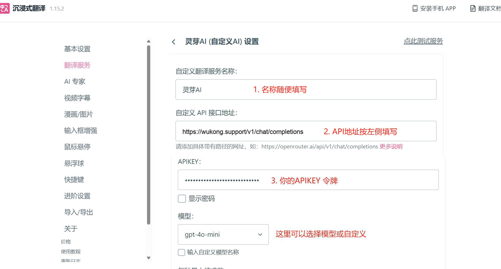
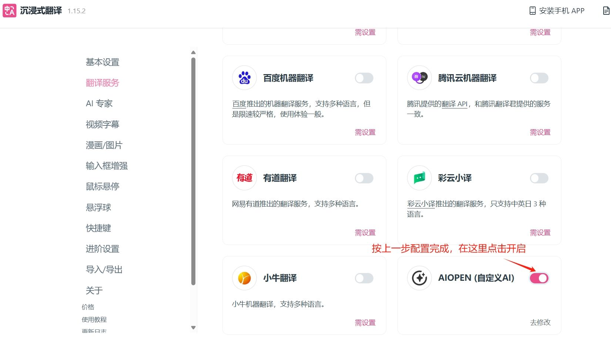

# 在沉浸式翻译中使用 悟空 API

> 沉浸式翻译：全网口碑炸裂的双语对照网页翻译插件

### Step 1
访问 `沉浸式翻译` 应用[https://immersivetranslate.com](https://immersivetranslate.com) 安装相应浏览器插件。

### Step 2

点击设置，打开配置页面，如下图示例配置

只需填写两项：
1. 接口地址：`https://api.wukong.support/v1/chat/completions`
2. Api Key：在 [我的令牌](https://wukong.support/console/token) 处创建复制你的专属 Api Key

