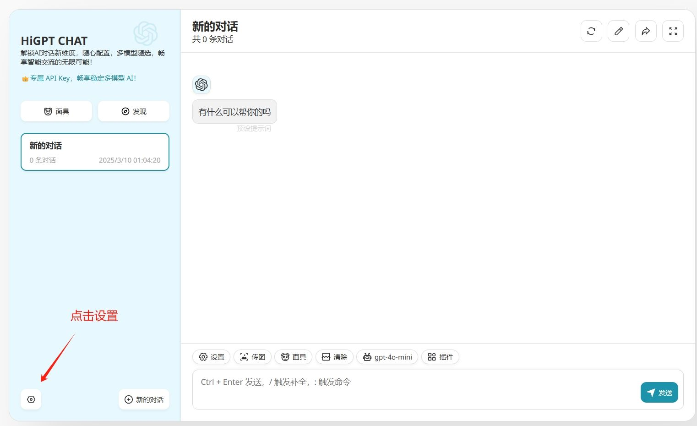
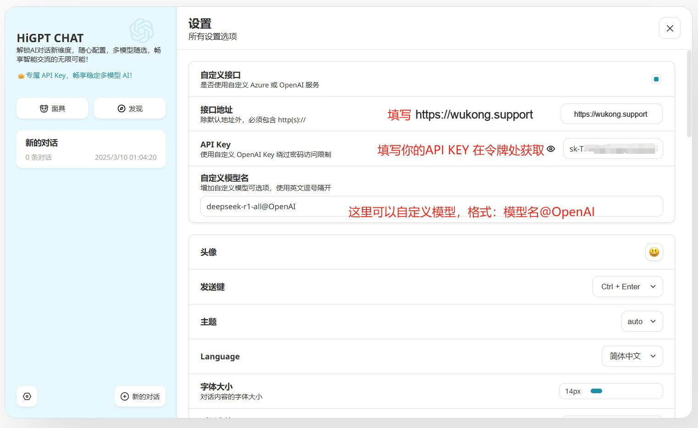

# 在HiGPT中使用 悟空 API

> HiGPT 是个对新手小白友好的AI对话客户端，只需2步配置可快速体验强大的AI服务，互交丝滑，方便快捷。

### Step 1
访问 `HiGPT` 应用[https://higpt.app](https://higpt.app)

### Step 2

点击左下角设置，打开配置页面，如下图示例配置

只需填写两项：
1. 接口地址：`https://api.wukong.support`
2. Api Key：在 [我的令牌](https://wukong.support/console/token) 处创建复制你的专属 Api Key

#### 自定义模型说明：
格式：`模型名@OpenAI` 如：deepseek-r1-all@OpenAI 具体模型名查看 [模型列表](https://wukong.support/modellist)

