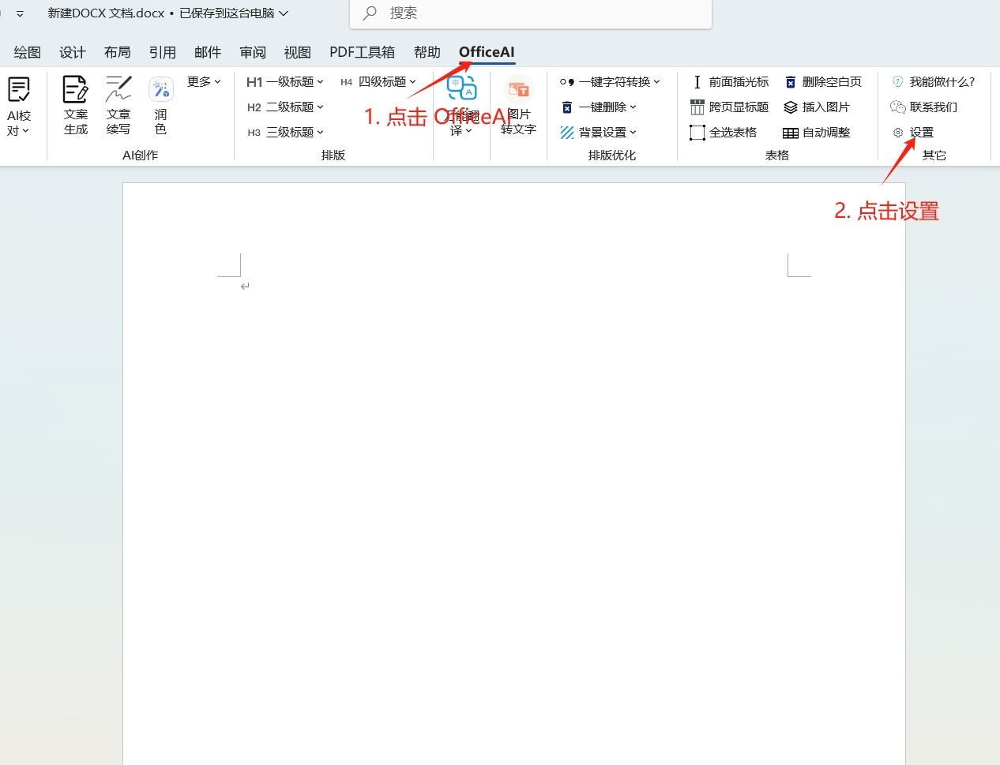
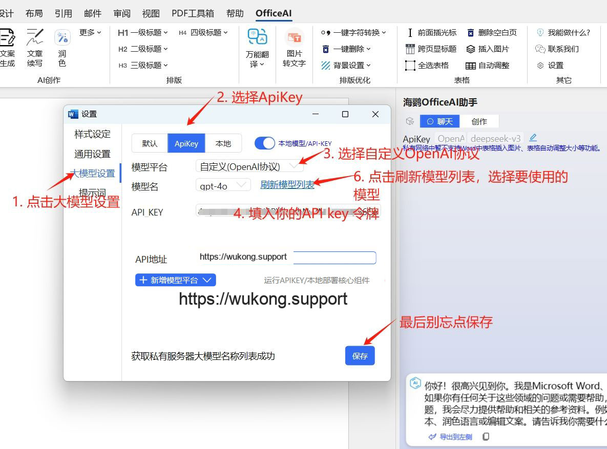

# 在OfficeAI助手中使用 悟空 API

> OfficeAI 助手 是一款免费的智能AI办公工具软件，专为 Microsoft Office 和 WPS 用户打造。
无论你是在寻找如何输入“打勾（√）符号”的方法，还是想知道“怎么在插入表格前添加文字”，或者“该用哪个公式”，
AI办公助手都能为你提供快速、准确的解决方案。
通过简单的指令，ExcelAI 插件可以帮你自动完成复杂的公式计算、函数选择。
WordAI 插件还具备整理周报、撰写会议纪要、总结内容、以及文案润色的强大功能。
总之，OfficeAI 助手将大大提升你的办公效率，让日常工作变得更加轻松便捷。

### Step 1
访问 `OfficeAI助手` 应用[https://www.office-ai.cn](https://www.office-ai.cn/) 下载助手。

### Step 2

在桌面新建一个 Word 文档，打开文档，如下图示例配置（WPS同理）

配置填写：
1. 接口地址（API地址）：`https://api.wukong.support`
2. Api Key：在 [我的令牌](https://wukong.support/console/token) 处创建复制你的专属 Api Key

