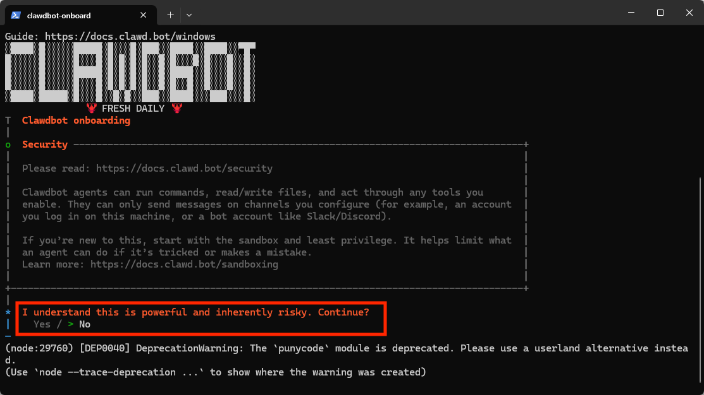
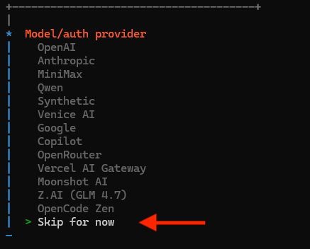
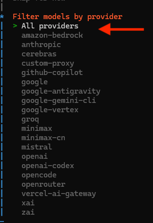
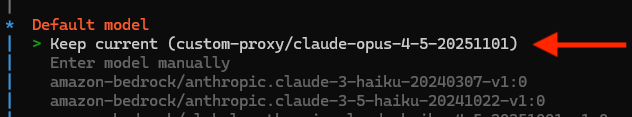
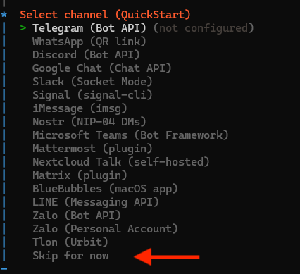
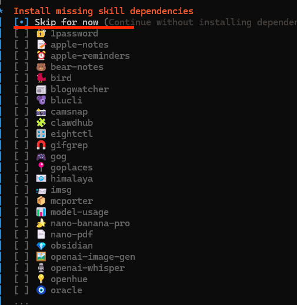
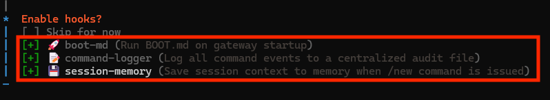
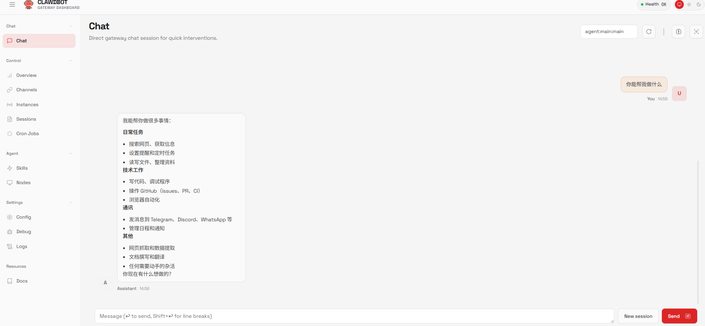

# OpenClaw（Clawdbot） 配置使用 API 教程

## 什么是 OpenClaw?

> OpenClaw 是一款开源的个人 AI 助理，支持本地或远程部署，并且是适用于任何操作系统的 AI 智能体网关。它支持 WhatsApp、Telegram、Discord、iMessage、飞书、QQ、钉钉等，直接运行在你常用的聊天软件里，发送消息，随时随地获取智能体响应。

参考 [OpenClaw官方中文帮助文档](https://docs.openclaw.ai/zh-CN)

## 一、安装 OpenClaw

请根据您的操作系统选择对应的安装方式。

### 1. 脚本安装（强烈推荐）

#### 🍎 MacOS / 🐧 Linux 用户

1. **运行安装脚本**  
   在终端中运行以下指令将自动安装 OpenClaw，然后继续下面第二步配置向导：
   ```sh
   curl -fsSL https://openclaw.ai/install.sh | bash
   ```

2. **验证安装**  
   验证 OpenClaw 是否安装成功：
   ```sh
   openclaw --version
   ```

#### 🪟 Windows (PowerShell) 用户

1. **运行安装脚本**  
   > **注意**：确保已经安装了 WSL2，在 PowerShell 中运行 WSL 进行以下安装。
   
   在终端中运行以下指令将自动安装 OpenClaw：
   ```sh
   iwr -useb https://openclaw.ai/install.ps1 | iex
   ```

2. **验证安装**  
   验证 OpenClaw 是否安装成功：
   ```sh
   openclaw --version
   ```

---

### 2. 初始化配置 OpenClaw

首先，启动交互式配置向导：

```sh
openclaw onboard
```



**请按以下步骤操作：**

1. 我们直接选择 **“快速开始”（QuickStart）**:

   

2. 直接选择 **“跳过”（Skip for now）**:

   

3. 选择 **“All providers”**:

   

4. 选择 **“Keep current”**:

   

5. 聊天工具也可以先选择 **“跳过”（Skip for now）**:

   

6. 配置 Skills，也可以先选择 **“跳过”（Skip for now）**，用空格键勾选，回车键确认:

   

7. **推荐设置**：建议把以下三个选项都选上，如下图所示：

   

🎉 **恭喜您已经完成了 OpenClaw 的配置向导！**

> **提示**：
> OpenClaw 会自动使用默认浏览器打开 OpenClaw 的网关界面。如网关未启动，可使用以下命令启动：
> ```sh
> openclaw gateway  
> ```

---

## 二、OpenClaw 接入第三方 API 接口

### 1. 获取第三方 API Key

1. 进入网站 **[https://wukong.support](https://wukong.support)** 进行注册并充值。
2. 在“令牌管理”页面，复制您的 **API Key**。
3. 建议新建令牌 -> 令牌分组选择：`ClaudeCode` 分组（或更便宜的分组），如果选择 `default分组` 成本可能较高。

### 2. 配置 API Key

完成以上安装后，在 OpenClaw 目录文件夹下，会有一个名为 `openclaw.json` 的文件。

**1. 打开配置文件**

可在终端输入以下命令直接打开 OpenClaw 目录文件夹：

```sh
open ~/.openclaw
```
*(Windows 用户如果在 WSL 下，可使用 `explorer.exe .` 打开当前目录)*

**2. 修改配置代码**

打开 `openclaw.json` 文件，配置 OpenClaw 的第三方 API 与模型名称。

请在配置文件替换覆盖```agents```、```models```原有内容，**注意修改 `apiKey` 为您自己的密钥**。以下代码使用了 `claude-sonnet-4-6` 模型，您可以根据需求修改模型名称。

```json
{
  "agents": {
    "defaults": {
      "model": {
        "primary": "wukongApi/claude-sonnet-4-6"
      },
      "models": {
        "wukongApi/claude-sonnet-4-6": {}
      }
    }
  },
  "models": {
    "mode": "merge",
    "providers": {
      "wukongApi": {
        "baseUrl": "https://api.wukong.support/v1",
        "apiKey": "sk-xxx",
        "api": "openai-completions",
        "compat": {
          "supportsPromptCacheKey": true
        },
        "models": [
          {
            "id": "claude-sonnet-4-6",
            "name": "claude-sonnet-4-6",
            "reasoning": false,
            "input": [
              "text",
              "image"
            ],
            "cost": {
              "input": 0,
              "output": 0,
              "cacheRead": 0,
              "cacheWrite": 0
            },
            "contextWindow": 200000,
            "maxTokens": 32000
          }
        ]
      }
    }
  }
}
```

> 如果将 `api` 改为 `openai-responses`，请保留 `compat.supportsPromptCacheKey: true`。OpenClaw 对非 OpenAI/Azure 的自定义 `baseUrl` 默认可能会剥离 `prompt_cache_key` 和 `prompt_cache_retention`，该配置用于声明中转站支持透传 prompt cache 字段，从而恢复缓存命中。

**3. 重启服务**

保存 `openclaw.json` 配置文件后，在终端输入以下命令重新启动 OpenClaw：

```sh
openclaw gateway
```

然后您将看到已配置好的 OpenClaw 网关界面：



🎉 **至此，您已经完成了 OpenClaw 的安装及第三方 API 的配置。**
