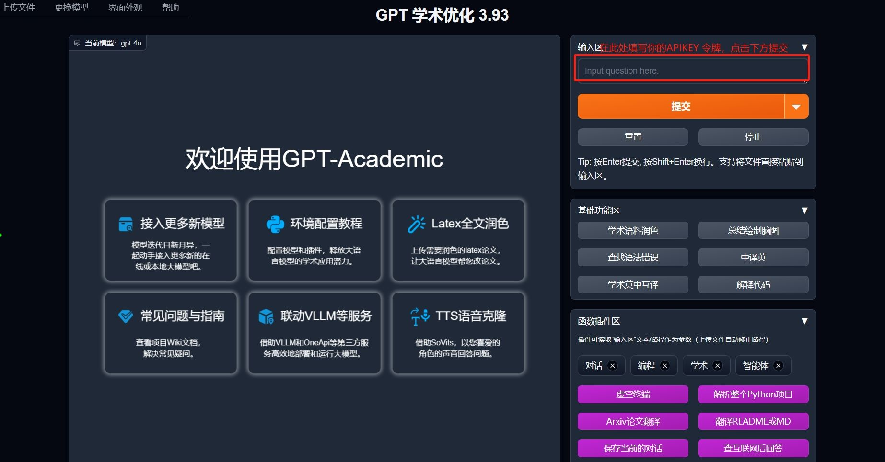

# 在GPT学术优化中使用 熊猫 API

> 为GPT/GLM等LLM大语言模型提供实用化交互接口，特别优化论文阅读/润色/写作体验，模块化设计，支持自定义快捷按钮&函数插件，支持Python和C++等项目剖析&自译解功能，PDF/LaTex论文翻译&总结功能，支持并行问询多种LLM模型，支持chatglm3等本地模型。

### Step 1
访问 `GPT学术优化` 应用[https://xueshu.higpt.app](https://xueshu.higpt.app)

### Step 2

只需配置你的API key

Api Key：在 [我的令牌](https://wukong.support/console/token) 处创建复制你的专属 Api Key

