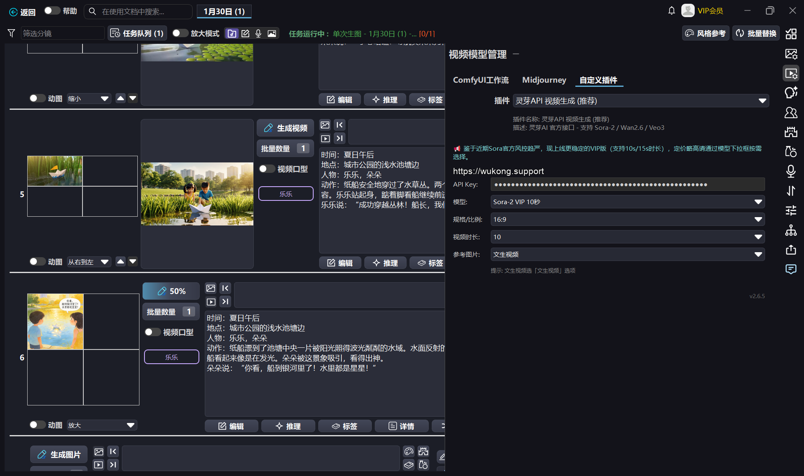

# 🎬 字字动画插件安装教程（视频+生图插件）

为了让“字字动画”软件具备更强大的视频生成与AI生图能力，请按照以下步骤安装 **悟空API** 插件包。

### 📂 第一步：定位插件目录
首先，打开你电脑上“字字动画”软件的安装根目录，并依次进入以下路径：
> **路径：** `安装根目录\_internal\plugins`

在该目录下，你会看到 `video_plugins`（视频插件文件夹）和 `image_plugins`（生图插件文件夹）。

---

### 🎥 第二步：安装视频插件
1.  **进入目录**：打开 `video_plugins` 文件夹。
2.  **下载安装包**：[点击下载视频插件包](/docs/static/video_plugin_wukong.rar)
    *   *下载地址：/docs/static/video_plugin_wukong.rar*
3.  **解压安装**：将下载好的压缩包直接解压到 `video_plugins` 文件夹内。

---

### 🎨 第三步：安装生图插件
1.  **进入目录**：退回上一级，打开 `image_plugins` 文件夹。
2.  **下载安装包**：[点击下载生图插件包](/docs/static/images_plugin_wukong.rar)
    *   *下载地址：/docs/static/images_plugin_wukong.rar*
3.  **解压安装**：将下载好的压缩包直接解压到 `image_plugins` 文件夹内。

---

### 🔄 第四步：重启并生效
1.  **重启软件**：完成上述解压操作后，请关闭正在运行的“字字动画”软件并**重新启动**。
2.  **确认效果**：重启后，进入软件的相关功能界面，确认已成功加载视频与生图功能模块。

---

### 📸 效果展示

> **💡 注意事项：**
> *   请确保解压后的文件直接位于对应的插件子目录中，不要嵌套多层同名文件夹。
